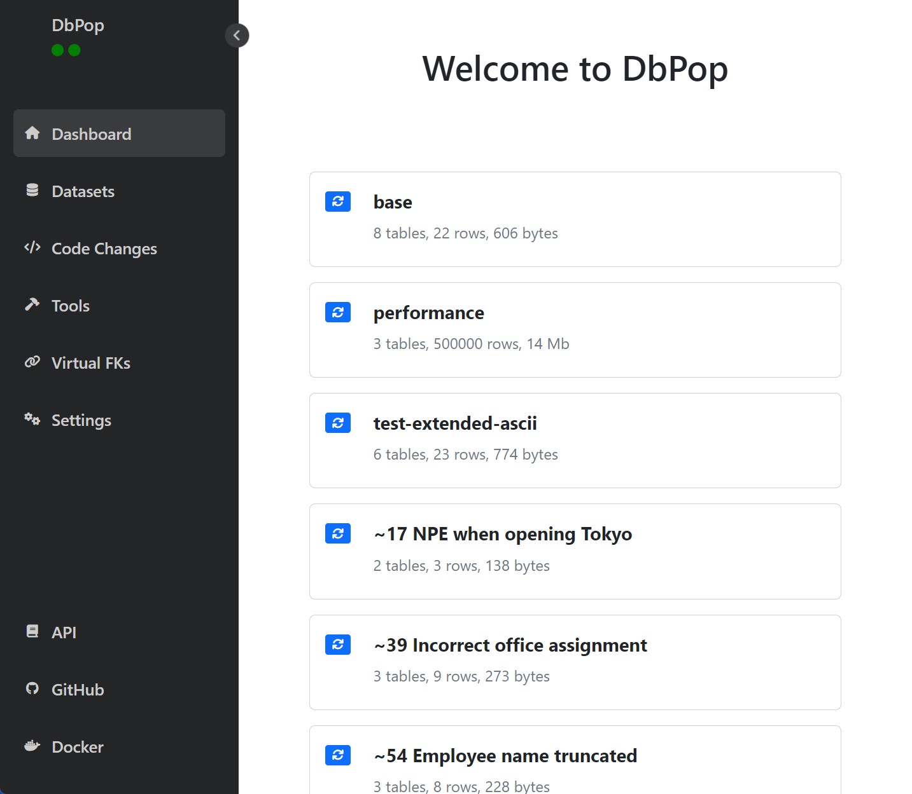

# DbPop - The easiest way to populate your development database

DbPop is an application to load seed data in a development database. The test data can be sampled from a copy of a production database using the web interface, or it can be crafted manually.

DbPop is distributed as a Docker application. It currently only supports SQL Server, but support for other databases is on the roadmap.

<!--suppress CheckImageSize -->


# Seed data

The use of seed data is a best practice in application development.
It provides many benefits, including faster development, more accurate testing, and easier maintenance of the
application's data model.

1. Faster development: Seed data allows developers to set up a new system or application quickly and efficiently. It eliminates the need to manually create test data, which can be time-consuming and error-prone.
2. Consistent data: Seed data ensures that the database contains consistent and accurate data. This is important when testing the application's behavior with real-world data, as it provides a consistent starting point for testing.
3. Easier maintenance: Seed data can be used to update the application's data model or schema over time. This is useful for adding new features or modifying existing ones, as it ensures that the database always contains the necessary data.
4. Improved testing: Seed data can help developers create more comprehensive and effective tests. By using realistic data, developers can more accurately simulate the behavior of the application in a real-world scenario.

# Usage

When the application is ready, open http://localhost:7104/ in your browser. 
The datasets can be loaded from the main Dashboard page. The active dataset is highlighted with a subtle green border.

The recommended way of delivering DbPop to the development team is by using a Docker Compose file and configuration files in your source control repository.
A [Docker Compose](https://docs.docker.com/compose/) file is used to start the development database and the DbPop application.
The datasets and setup files are also under source control and follow the lifecycle of application development.
For example, new tests added in a feature branch may be based on new datasets and will eventually be merged into the main branch.

When DbPop starts up, it waits until the database is fully up and running then runs the setup scripts, and loads the static and base datasets.


A volume is defined in docker-compose.yml that lets DbPop access the datasets and installation scripts defined in your repository.
An example is available in the [/doc/demo/](https://github.com/cdandoy/DbPop/tree/master/doc/demo) directory

```
version: "3.9"
services:
  dbpop:
    image: "cdandoy/dbpop"
    ports:
      - "7104:7104"
    volumes:
      - .:/var/opt/dbpop
    environment:
      - TARGET_JDBCURL=jdbc:sqlserver://mssql-target;database=tempdb;trustServerCertificate=true
      - TARGET_USERNAME=sa
      - TARGET_PASSWORD=Passw0rd
    depends_on:
      - mssql-target
  mssql-target:
    image: mcr.microsoft.com/mssql/server
    ports:
      - "1433:1433"
    environment:
      - MSSQL_SA_PASSWORD=Passw0rd
      - ACCEPT_EULA="Y"
```

In this example, the tables are created using simple SQL scripts, but if your database is composed of many tables, we recommend creating a Docker image of an empty version of the database,
the apply the database changes using  [Flyway](https://hub.docker.com/r/flyway/flyway)
or [Liquibase](https://hub.docker.com/r/liquibase/liquibase).
Creating an ideal development environment for your team may take time, but it will have a tremendous impact on your team's productivity.

<i>The Code section of DbPop is an alternative, but it is still in development.</i>

# Datasets

The test data is structured in datasets and stored in CSV files.
The file structure maps to the database table qualified names: `/dataset/catalog/schema/table.csv`

Before to load a dataset, DbPop deletes the data from all the tables defined in any of the datasets. If a table must be seeded empty, just create an empty CSV file. 

There are two special datasets:

* **static**: This dataset is only loaded once per session.<br/>
  It should contain the data that is never updated by your application.<br/>
  This is where you would typically store lookup data. The static dataset cannot be loaded explicitely.
* **base**: This dataset is always reloaded first when you load another dataset.<br/>
  It should contain data that you want to always be available and that you want to build upon.<br/>
  You may want for example to always have one customer, with one order and one invoice and another dataset could complete that data with a
  return to test the processing of returns.<br/>
  The base dataset can be loaded explicitely. Smaller applications may only need a base dataset.

In addition to the two special datasets, this example shows two custom datasets:
The example below shows the file structure with a static and base dataset as well as two custom datasets.

```
+-- datasets
    |-- static                               - The static dataset is only loaded once per session
    |    +-- demo
    |         +-- hr
    |              +-- offices.csv
    |
    |-- base                                 - The base dataset is always reloaded
    |    +-- demo
    |         +-- hr
    |              |-- departments.csv
    |              +-- employees.csv
    |              
    +-- performance                          - Example of a custom dataset
    |    +-- demo
    |         +-- hr
    |              |-- departments.csv
    |              +-- employees.csv
    +-- test-extended-ascii                 - Example of a custom dataset
         +-- demo
              +-- hr
                   +-- employees.csv
```

## Date Expressions
Date columns can be populated using [ISO 8601](https://www.w3.org/TR/NOTE-datetime) format or using expressions surrounded by double curly braces.<br/>
Examples of valid expressions: `{{now}}`, `{{today}}`, `{{yesterday}}`, `{{now - 1 hour}}`, `{{today - 3 days}}`, ...

# Installation Scripts

Scripts can be stored in the `/setup/`directory and will be executed when the application starts.
The scripts are shell scripts ([ash](https://linux.die.net/man/1/ash)) or SQL files.
When the installation script complete successfully, the file `/setup/install-complete.txt` is created.
If that file exists, the installtion scripts are no longer executed, except for `startup.sh` which is always executed at startup.

* `pre-install.sh`: Shell script executed before the SQL files.
* `*.sql`: SQL files are executed in alphabetical order.
* `post-install.sh`: Shell script executed after the SQL files.
* `startup.sh`: Shell script executed everytime DbPop starts.

An example of installation scripts is available in the [/doc/demo/](https://github.com/cdandoy/DbPop/tree/master/doc/demo) directory

```
+-- setup
    |-- pre-install.sh
    |-- setup_01_create_database.sql
    |-- setup_02_create_tables.sql
    +-- post-install.sh
```

## REST API

While it is easier for a developer to use the user interface to reload the data during development, you may want to
automate the test using the REST API.

Resetting a dataset is as simple as hitting the URL: http://localhost:7104/populate?dataset=base

You can specify multiple datasets on the same request: http://localhost:7104/populate?dataset=base&dataset=ADV-7412

You can access the API documentation here: http://localhost:7104/api-docs/